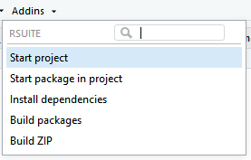
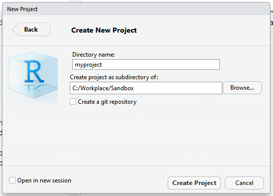
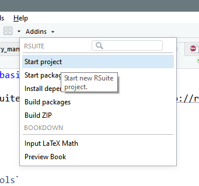
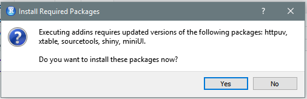
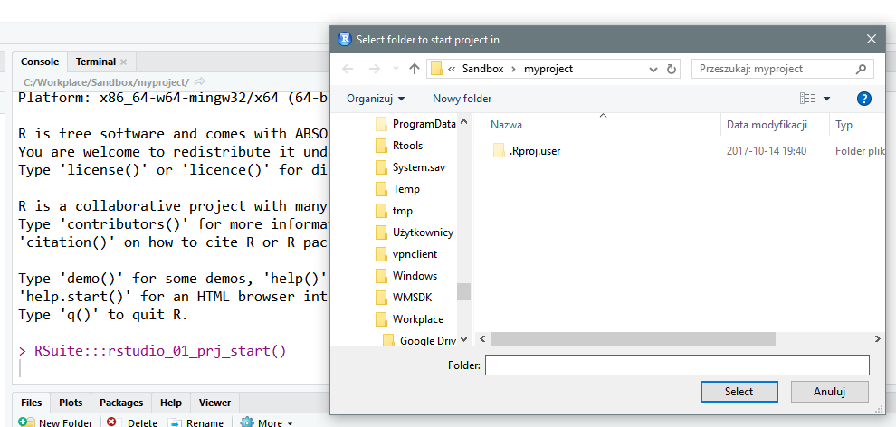
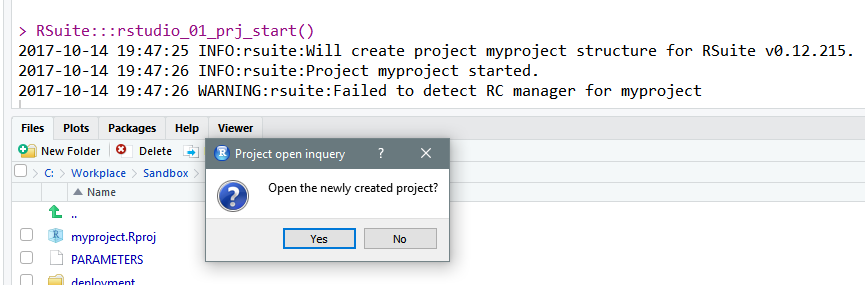
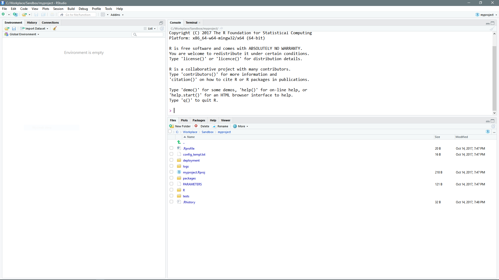
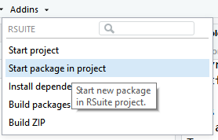

# Using R Suite via R Studio's Addins

R Studio has great functionality of Addins that makes it extensible. We used it to make more friendly interface to R Suite for those who are users of this great IDE for R development.

## Start a new R Suite Project

### Start R Studio project

First start R Studio project called `myproject`.

### Starting R Suite project

After starting new R Studio project we have to upgrade it to R Suite project. We do this via `Addins > RSUITE > Start project`.

### Installing extra packages

If you are doing this for the first time you can see the following dialog window

It is safe to say `Yes`. 

### Selecting folder with R Suite project

After a short while you will see another popup

You just click `Select`. After this you are asked if you want to open R Suite project in a new R Studio windows.

### Opening R Suite project in a new R Studio window

If you click `Yes` a new R Studio will open.

## Add new package to R Suite Project

You can start a new package via `Addins > RSUITE > Start package in project`. 

