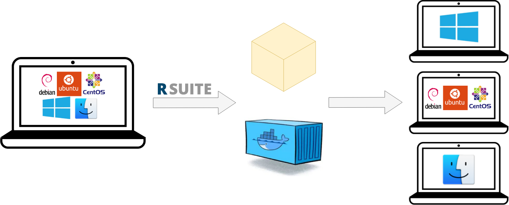
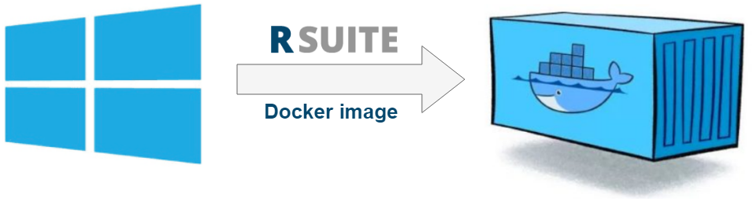

# R Suite deployment
This document presents how R Suite supports the deployment of R based solutions.

The following scenarios are presented:

* Deployment using ZIP packages
* Deployment using Docker images

**Important:** This tutorial was tested with R Suite version 0.32-245

## Table of contents ##

<!-- markdown-toc start - Don't edit this section. Run M-x markdown-toc-refresh-toc -->
**Table of Contents**

- [R Suite deployment](#r-suite-deployment)
    - [Table of contents](#table-of-contents)
    - [**Got stuck?**](#got-stuck)
- [Motivation](#motivation)
- [Deployment with ZIP packages](#deployment-with-zip-packages)
    - [Development on Windows and production on Windows](#development-on-windows-and-production-on-windows)
    - [Development on Any System and production on Linux (Ubuntu, Debian or CentOS)](#development-on-any-system-and-production-on-linux-ubuntu-debian-or-centos)
- [Deployment using docker images](#deployment-using-docker-images)
- [Summary](#summary)
- [List of used commands](#list-of-used-commands)

<!-- markdown-toc end -->

## **Got stuck?**

If you are stuck feel free to contact us:

* through the R Suite website (http://rsuite.io#contact) or 
* using Gitter [R Suite room](https://gitter.im/WLOGSolutions/RSuite
"Gitter R Suite room")
* directly by sending an email with the description of your problem to
  [rsuite@wlogsolutions.com](mailto:rsuite@wlogsolutions.com).
    
# Motivation
Assume that you are writing some kind of software in R like, for example, a Shiny application or a complicated predictive model. Your solution is finished, well documented and tested. Now comes the time of running your program on the target platform. You start by preparing the production environment: installing R and required packages. The longly anticipated moment of running your software has arrived. You start your program and you receive an error message or perhaps your solution works differently than on your computer. 


The above-described process is deployment - activities concerning making your software available for use. An often occurring challenge during this procedure is providing reproducibility. Reproducibility is the ability to run your code repeatedly at different times, using different computers in such a way that giving the same inputs results in obtaining the same outputs. Assuring reproducibility is a difficult task as issues may come from several sources:

* `Code` - not setting a seed when generating random numbers, which makes the code nondeterministic

* `Dependency Hell` - required packages might have conflicting dependencies, additionally as R can be used on multiple platforms (Windows, Linux and MacOS) dependencies might require specific system libraries

* `Backward compatibility` - updated versions of packages might work differently than others which may cause your solution to break

R Suite aims to enhance your deployment process by supporting the reproducibility of your projects with package versions, system requirements and repository management features. Additionally, R Suite facilitates automated deployment by using deployment zips and Docker images.

<br><br>

<br><br>

In this article, you are going to deploy the [drinkR app](http://www.sumsar.net/blog/2014/07/estimate-your-bac-using-drinkr/) using the mentioned R Suite's deployment feature. The tutorial has the following prerequisites:

* knowledge of basic R Suite commands is required, consider reading the [Basic R Suite usage](http://rsuite.io/RSuite_Tutorial.php) article

* download the source code from https://github.com/WLOGSolutions/rsuite_drinkR and unzip it into a directory called `rsuite_drinkR` - the original code was modified in order to fit the R Suite project structure

* make sure that you have `R-3.4` or greater installed

* make sure that Docker is installed and running on your computer, some of the commands that you will be using require Docker running in the background (you can use the following guide: https://docs.docker.com/install/#supported-platforms)

* a

# Deployment with ZIP packages
Deployment zips are archives containing all the necessary information to run your software on a production environment. These are especially practical in cases when you want to share your solution with friends, colleagues or teachers, they only need to have the correct R version installed.


<br><br>

<br><br>

It is important to point out that your target platform might be running a different operating system. Fortunately, R Suite allows us to create deployment zips for different systems, the following scenarios are supported:

* creation of deployment zips for the **same** operating system that is used on the development platform

* creation of deployment zips for Ubuntu, Debian and CentOS

## Development on Windows and production on Windows

Let's assume that you are using Windows as your development platform in that case you can create a deployment zip for Windows by using the following command.

```bash
> cd rsuite_drinkR
> rsuite proj zip --version 1.0
```

It will result in creating a deployment zip called `rsuite_drinkR_1.0x.zip`. The `--version` option is used to enforce a specific version of the project. If you are using Git or SVN for version control (which is highly recommended!) `rsuite proj zip` will automatically use the revision number of your repository. You also don't have to be in the project directory, you can pass the path to the project using the `-p` (short for `--path`) option.

<br><br>

<br><br>

Now you can share your solution with Windows users using the freshly created deployment zip. Remember that the production environment has to have to proper R version installed! For the sake of this tutorial we will unzip it to a directory called production. After doin so, you can run your program with the following command

```bash
> Rscript production/rsuite_drinkR/R/master.R --port=7137
```
If your application is running, it should be available at http://127.0.0.1:7137.

**Important:** You don't have to be using Windows necessarily. If you are a Mac user, you can create a deployment zip for Macs using the same commands.

## Development on Any System and production on Linux (Ubuntu, Debian or CentOS)

What if we want to create a deployment zip for a different operating system than the one we are using? In that case we can use one of R Suite's Docker functionalities! Just issue this command
```bash
> rsuite docker zip --version 2.0 -p ubuntu
```

<br><br>

<br><br>

This will create a file called `rsuite_drinkR_2.0x.zip`. The `--version` option is used to enforce a specific version of the project. If you are using Git or SVN for version control (which once again is highly recommended!) `rsuite proj zip` will automatically use the revision number of your repository. 

It will create a deployment zip called `rsuite_drinkR_2.0x.zip`. Like previously we can now unzip the archive on Ubuntu and run our solution.

# Deployment using docker images
If your production environment supports Docker containers or the target platform is not supported by R Suite, you can deploy your project using Docker containers. R Suite allows you to create Docker images containing your project. To create an image containing your solution use the following command

```bash
> rsuite docker img -t drinkr_image:1.0
```
<br><br>

<br><br>

This will create a Docker image called `drinkr_image:1.0`. The `-t` option (short for `--tag`) is used to set the name and the version of the image. If you are using Git or SVN for revision control (yes we will recommend it for the third time), you can omit the version number as R Suite will automatically use the revision number.

This will create a Docker image called `drinkr_image`, to check if everything worked properly issue the following command
```bash
> docker images
```

`drinkr_image` should be listed in the output
```
REPOSITORY          TAG                     IMAGE ID            CREATED             SIZE
drinkr_image        1.0                     4f7ce9144f73        2 hours ago         1.31GB
```

To check if everything is working properly, we will start a container using the freshly created image and we will run our drinkR app
```bash
> docker run --name drinkr -p 7137:7137 -d --rm drinkr_image:1.0
> docker exec -it drink bash
> Rscript rsuite_drinkR/R/master.R --port=7137
```

If your application is running, it should be available at http://127.0.0.1:7137

To stop the container, issue the following command:
```bash
> docker stop drinkr
```

You can now share your solution by publishing your Docker image on Dockerhub. In this case, you are not only sharing your software, but also the environment configured in the container. That means that your solution will work everywhere where Docker containers are supported.

# Summary
R Suite provides user-friendly ways of deploying R based solutions: deployment zips and Docker images. No more worrying about package compatibility, version conflicts or system requirements. The only thing left is preparing the production environment: installing the proper R version or installing Docker.

# List of used commands
 
* [rsuite proj zip](http://rsuite.io/RSuite_Tutorial.php?article=rsuite_cli_reference.md#building-deployment-package)
* [rsuite docker zip](http://rsuite.io/RSuite_Tutorial.php?article=rsuite_cli_reference.md#building-project-under-different-platform-in-docker-container)
* [rsuite docker img](http://rsuite.io/RSuite_Tutorial.php?article=rsuite_cli_reference.md#building-docker-image-for-solution)
